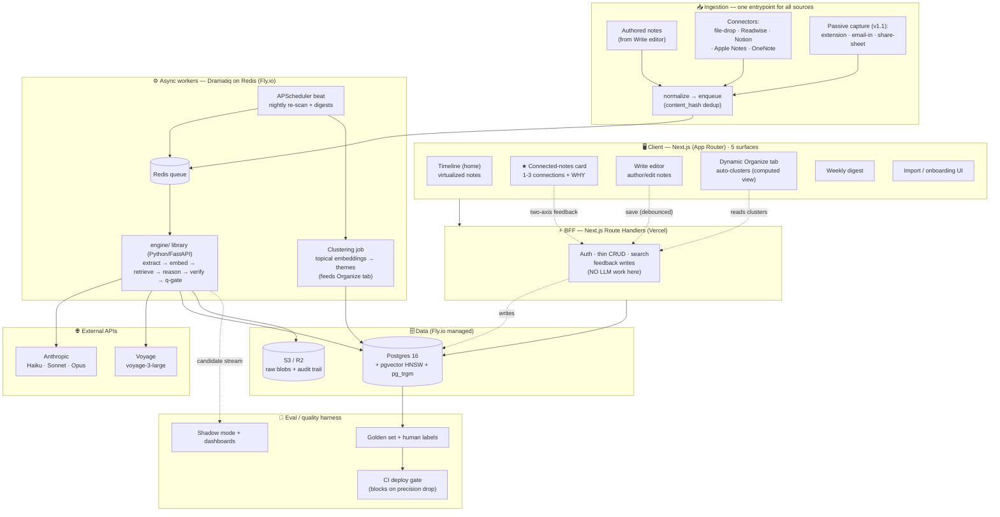
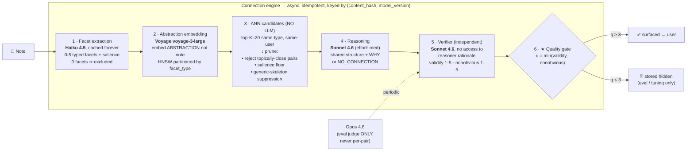
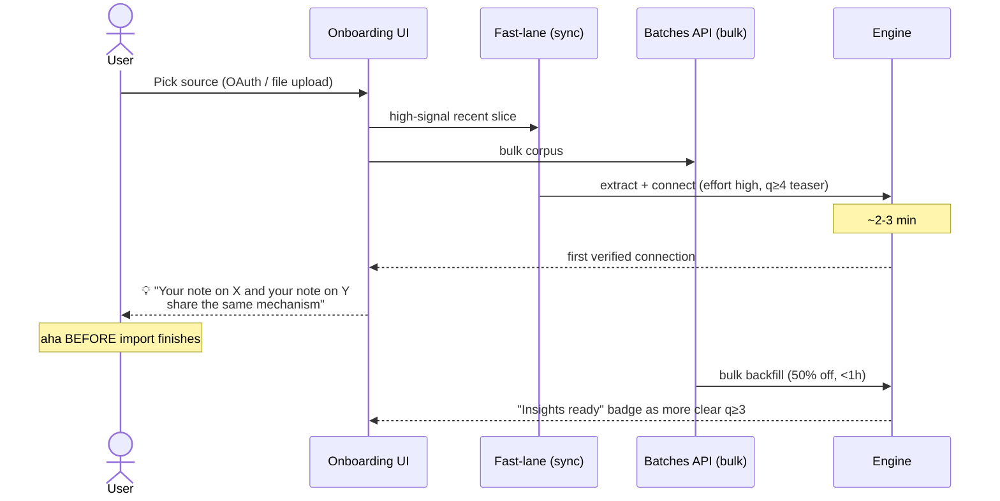
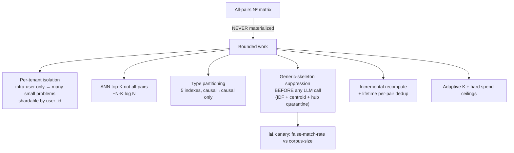

# Architecture Diagrams

Rendered with Mermaid. See [ARCHITECTURE.md](ARCHITECTURE.md) for the full spec.

## 1. System architecture (end-to-end)

## 2. The connection engine pipeline

## 3. Import → first-insight onboarding (the activation moment)

## 4. The N² scaling solution

